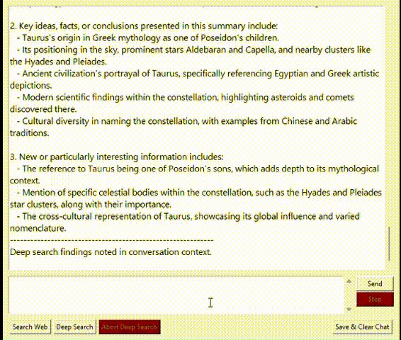

#  HANDS-ON: Offline Mini LLM Chat App (Phi-3 ONNX)

Welcome! This is a **real-deal, hands-on** local chat app using Microsoft's [Phi-3-mini-4k-instruct-onnx](https://huggingface.co/microsoft/Phi-3-mini-4k-instruct-onnx) model. I built this app to learn by doing — no APIs, no middlemen, just raw models running directly on my humble laptop (**Core i3-1215U, 8GB DDR4 RAM**). If you believe in learning by doing, this project is for you.

---

##  Why I Built This

I didn't want to rely on pre-made LLM tools like Ollama. I wanted to feel the model running, fail at packaging it, and fix it piece by piece.

- **V1:** Used llama GGUF – failed to package the app
- **V2:** Used HuggingFace + Transformers – worked but was too slow
- **V3 (this version):** ONNX — faster on CPU, easier to run locally and even on mobile!

---

##  Features

-  Offline Chat with Phi-3 ONNX (CPU-compatible)
-  Simple, functional GUI
-  Integrated web search using Playwright
-  Smart summarization & chunking for long web results
-  Configurable system prompt and generation parameters
-  Fully loggable and debuggable
-  Packaged for Windows (.exe)

---
##  DEMO

<p align="center">
  
</p>

---
##  Folder Structure (Search & Summarization Logic)

When you run a web search, the app creates structured folders to manage input/output flow:


| `web_searches/`                                         | `model_search_summary/`                             |
|---------------------------------------------------------|-----------------------------------------------------|
| `├── search_attempt_1/`                                 | `├── search_attempt_1_summary/`                     |
| `├── search_attempt_2/`                                 | `├── search_attempt_2_summary/`                     |
| `└── search_attempt_3/`                                 | `└── search_attempt_3_summary/`                     |
| `    ├── search_data_1.txt`                             | `    ├── search_data_1_summary.txt` |
| `    ├── search_data_2.txt  (long result:)`             |                                                 |
| `      ├── search_data_2_chunk_1_summary.txt`           | `    ├── search_data_2_chunk_1_summary.txt` |
| `      ├── search_data_2_chunk_2_summary.txt`            | `    ├── search_data_2_chunk_2_summary.txt` |
| `    └── urls_n_headlines.txt`                          | `    └── all_deep_search_answers.txt` |


This helps with:
- Saving all search results and their sources
- Chunking large texts to fit the 4K token limit
- Letting the model summarize deeply and output what it learned

---

##  How to Set It Up (The Fast Way)

### 1. Download the Model
Download the Phi-3 ONNX model manually:

- Go to [Hugging Face model page](https://huggingface.co/microsoft/Phi-3-mini-4k-instruct-onnx#cpu)
- Download:  
  `cpu_and_mobile/cpu-int4-rtn-block-32/`
- Place the files like this:

/your_app_folder/Phi-3-mini-4k-instruct-onnx/cpu_and_mobile/cpu-int4-rtn-block-32/ ... the model files


### 2. Install Required Dependencies
Don't foget to check the file manually for the versions
```bash
pip install -r requirements.txt
playwright install
```
Or manually install:
```bash
pip install onnxruntime-genai huggingface_hub playwright readability-lxml httpx beautifulsoup4 numpy
```

### 3. Setup Playwright Browsers
Copy ms-playwright folder to your app directory:
```bash
%USERPROFILE%\AppData\Local\ms-playwright
```

### 4. Run the App 
 - Ensure `config.json` is next to the `.exe`
 - Double-click the app or run the script through Python
 - Start chatting or web searching!

## Configuration
You can customize system behavior in `config.json`:
```json
{
  "system_prompt": "You are a helpful assistant.",
  "generation_params": {
    "temperature": 0.7,
    "top_p": 0.95,
    "max_tokens": 1024
  }
}
```
---

##  Key Dependencies
This app runs on:

Python 3.11.9
- ONNXRuntime + ONNXRuntime-GenAI
- Hugging Face Hub
- Playwright
- BeautifulSoup4
- Readability-lxml
- HTTPX
- NumPy, SciPy, and more
  
(Full list included in `requirements.txt` and `requirementsVersions.txt`)

---
## Packaging Notes

PyInstaller doesn't always play nice. Many libraries needed to be explicitly included (like numpy, httpx, onnxruntime, playwright). After many trial-and-error attempts, this version runs smoothly as a standalone .exe.

If you want a fully working .zip (~3.5 GB), contact me and then we'll figure out if it's legal to send you the whole package.

##  License Notice
This project uses the [Phi-3 Mini ONNX model](https://huggingface.co/microsoft/Phi-3-mini-4k-instruct-onnx#cpu) by Microsoft under the MIT License. You must comply with its terms when downloading and using the model.

##  Contact & Contribution
Feel free to reach out — I’m happy to help!

##  Final Notes
This is a personal learning project, made to push limits, get closer to how LLMs really work, and have fun along the way. It’s not perfect — but it’s practical, local, and yours to explore.

Enjoy!
